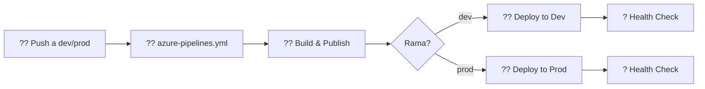
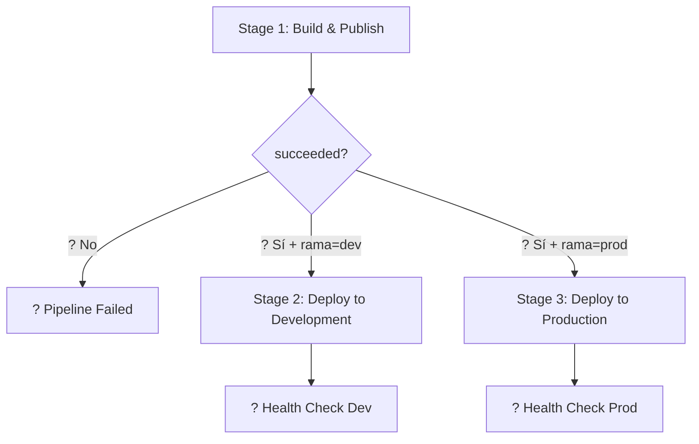
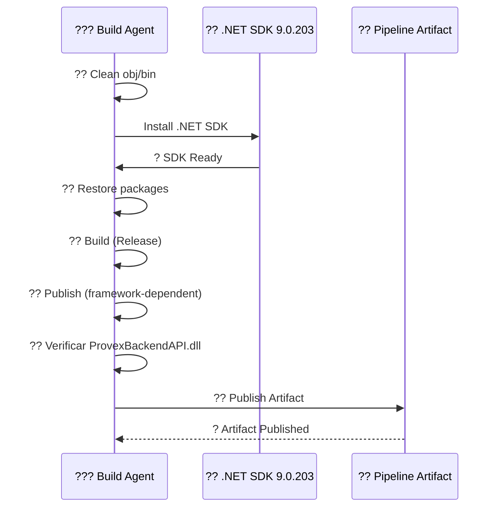
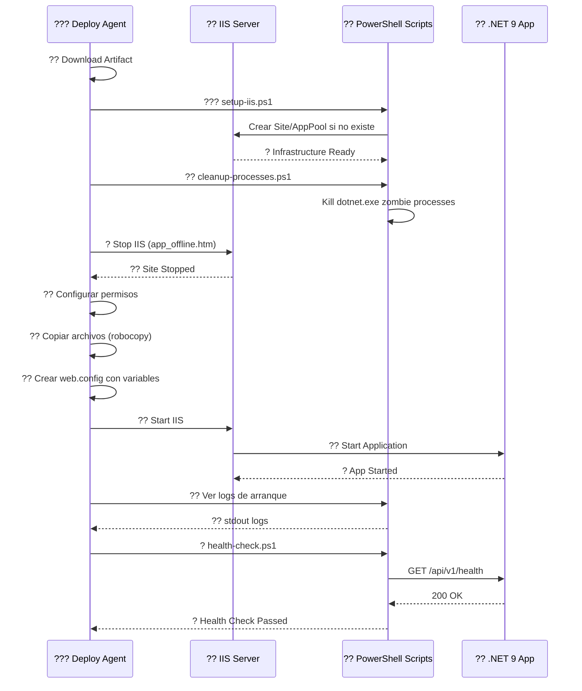
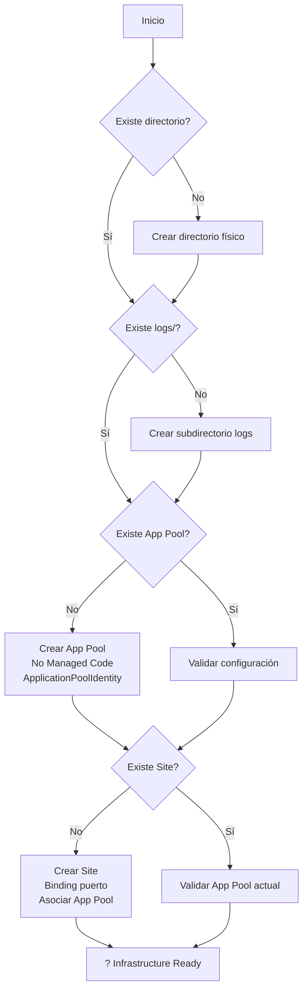
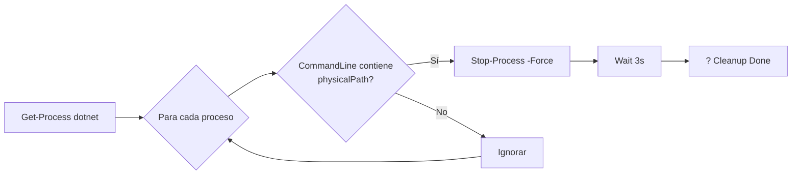
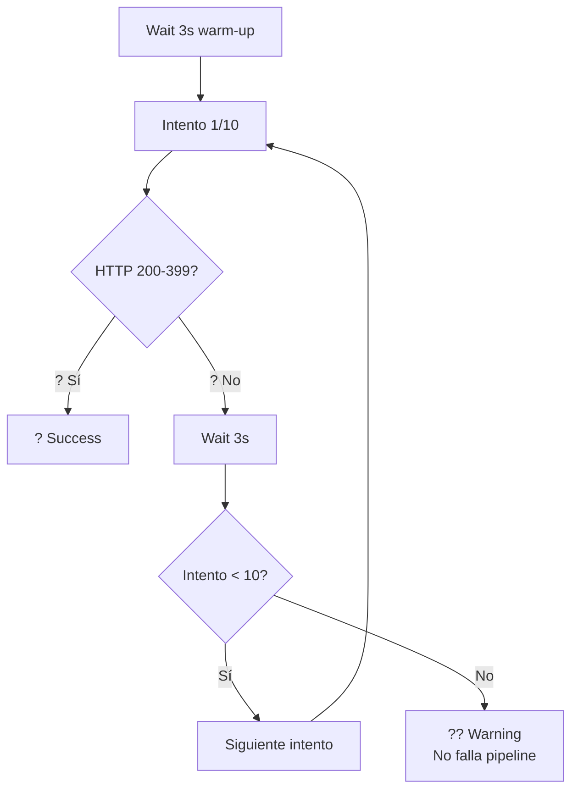

# ERP Backend API (.NET 9) - Pipeline de CI/CD

## ?? Descripción General

Pipeline automatizado para **build**, **deploy** y **validación** de la API .NET 9 en ambientes **Development** y **Production** desplegando en IIS.

---

## ?? Estructura de Archivos

```
ERP-BackEnd/
??? azure-pipelines.yml                    # ?? Orquestador (trigger point)
?   ??? extends: pipelines/azure-pipelines-backend.yml
?
??? pipelines/
?   ??? azure-pipelines-backend.yml        # ?? Pipeline principal (stages)
?   ??? templates/
?   ?   ??? deploy-backend-template.yml    # ?? Template reutilizable Dev/Prod
?   ??? scripts/
?   ?   ??? setup-iis.ps1                  # ??? Crear infraestructura IIS
?   ?   ??? cleanup-processes.ps1          # ?? Limpiar procesos zombie
?   ?   ??? health-check.ps1               # ? Validación post-deployment
?   ??? README.md                          # ?? Este archivo
?
??? ProvexBackendAPI/
    ??? ... (código fuente)
```

---

## ?? Flujo de Ejecución

### **Diagrama de Flujo General**



### **Triggers**

| Rama | Acción | Deploy a |
|------|--------|----------|
| `dev` | Push automático | Development (IISDev) |
| `prod` | Push automático | Production (IISAgent01) |

---

## ??? Stages del Pipeline

### **?? Diagrama de Stages**



---

### **Stage 1: ?? Build & Publish**



**Pasos:**
1. ? Limpiar directorios `obj/` y `bin/`
2. ? Instalar .NET SDK 9.0.203
3. ? Restore de paquetes NuGet
4. ? Build en modo `Release`
5. ? Publish (framework-dependent deployment)
6. ? Verificar que `ProvexBackendAPI.dll` existe
7. ? Publicar artifact del pipeline

---

### **Stage 2/3: ?? Deploy to IIS (Dev/Prod)**



**Pasos detallados:**

| # | Paso | Script/Acción | Descripción |
|---|------|---------------|-------------|
| 1 | ?? Download Artifact | Pipeline | Descarga artifact del stage Build |
| 2 | ??? Setup IIS | `setup-iis.ps1` | Crea Site, AppPool, directorios si no existen |
| 3 | ?? Resolver paths | Inline PowerShell | Encuentra ruta del artifact |
| 4 | ?? Cleanup zombie | `cleanup-processes.ps1` | Mata procesos `dotnet.exe` bloqueados |
| 5 | ? Stop IIS | Inline PowerShell | Crea `app_offline.htm`, detiene Site/AppPool |
| 6 | ?? Permisos | Inline PowerShell | Configura permisos para AppPool |
| 7 | ?? Copy files | Robocopy | Copia archivos (excluye `logs/`, `app_offline.htm`) |
| 8 | ?? web.config | Inline PowerShell | Genera `web.config` con variables de entorno |
| 9 | ?? Start IIS | Inline PowerShell | Elimina `app_offline.htm`, inicia AppPool/Site |
| 10 | ?? View logs | Inline PowerShell | Muestra últimas 100 líneas de `stdout` |
| 11 | ? Health check | `health-check.ps1` | Valida endpoint `/api/v1/health` (10 reintentos) |

---

## ?? Variables Requeridas en Azure DevOps

### **?? Variable Group: `ERP-Backend-Development`**

| Variable | Descripción | Ejemplo |
|----------|-------------|---------|
| `agentName` | Nombre del agente IIS | `IISDev` |
| `siteName` | Nombre del sitio IIS | `ERPApiSite` |
| `appPoolName` | Nombre del App Pool | `ERPApiPool` |
| `physicalPath` | Ruta física | `C:\inetpub\wwwroot\ERPApi` |
| `bindingPort` | Puerto del sitio | `8082` |
| `VerifyUrl` | URL de health check | `http://10.115.1.252:8082/api/v1/health` |
| `ASPNETCORE_ENVIRONMENT` | Entorno | `Development` |
| `ConnectionStrings__DatabaseConnection` | Connection string | `Server=10.115.1.252;Database=...` |
| `Jwt__Issuer` | Emisor JWT | `Provex.Auth` |
| `Jwt__Audience` | Audiencia JWT | `ProvexBackend.Client` |
| `Jwt__Key` | Clave JWT | `Pr0v3xAuth0.2025@...` |
| `SecretKey` | Clave secreta | `Esta es una clave...` |
| `AzureAd__Instance` | Azure AD Instance | `https://login.microsoftonline.com/` |
| `AzureAd__Domain` | Dominio | `https://provexsa.com` |
| `AzureAd__TenantId` | Tenant ID | `b53c62c4-9e71-...` |
| `AzureAd__ClientId` | Client ID | `30597db0-8dfd-...` |

### **?? Variable Group: `ERP-Backend-Production`**

*(Mismas variables que Development, valores diferentes)*

| Variable | Ejemplo |
|----------|---------|
| `agentName` | `IISAgent01` |
| `bindingPort` | `8083` |
| `VerifyUrl` | `https://api2.provexsa.cl/health` |
| `ASPNETCORE_ENVIRONMENT` | `Production` |
| `ConnectionStrings__DatabaseConnection` | `Server=10.115.1.251;Database=...` |

---

## ?? Scripts PowerShell

### **??? `setup-iis.ps1`**



**Funcionalidad:**
- ? Crea estructura de directorios si no existe
- ? Crea App Pool con configuración .NET Core (No Managed Code)
- ? Crea Site IIS con binding en puerto especificado
- ? Configura timeouts (idle: 20min, startup: 5min)
- ? Valida y corrige configuración si ya existe

---

### **?? `cleanup-processes.ps1`**



**Funcionalidad:**
- ? Busca procesos `dotnet.exe` corriendo desde `physicalPath`
- ? Mata procesos zombie que bloquean archivos
- ? Espera 3 segundos antes de continuar

---

### **? `health-check.ps1`**



**Funcionalidad:**
- ? Realiza hasta 10 intentos (30s máximo)
- ? Espera 3s entre intentos
- ? Valida status code 200-399
- ?? No falla el pipeline (solo warning) para permitir troubleshooting manual

---

## ?? Template Reutilizable

### **`deploy-backend-template.yml`**

**Parámetros:**

| Parámetro | Tipo | Descripción | Ejemplo |
|-----------|------|-------------|---------|
| `environment` | string | Nombre del entorno | `Development` |
| `variableGroup` | string | Variable group de Azure DevOps | `ERP-Backend-Development` |
| `agentName` | string | Nombre del agente IIS | `IISDev` |

**Uso:**

```yaml
- template: templates/deploy-backend-template.yml
  parameters:
    environment: Development
    variableGroup: ERP-Backend-Development
    agentName: $(agentName)
```

---

## ?? Cómo Usar Este Pipeline

### **1. Desarrollo Local**

```bash
# Crear rama feature
git checkout -b feature/nueva-funcionalidad

# Hacer cambios en código
code ProvexBackendAPI/

# Commit
git add .
git commit -m "feat: Nueva funcionalidad"

# Push (NO activa pipeline)
git push origin feature/nueva-funcionalidad
```

### **2. Deploy a Development**

```bash
# Crear Pull Request a dev
# Azure DevOps ? Pull Requests ? New Pull Request
# Source: feature/nueva-funcionalidad ? Target: dev

# Aprobar y completar PR
# ? Pipeline se ejecuta automáticamente en rama dev
```

### **3. Deploy a Production**

```bash
# Crear Pull Request a prod
# Source: dev ? Target: prod

# Aprobar y completar PR
# ? Pipeline se ejecuta automáticamente en rama prod
```

---

## ?? Troubleshooting

### **? Error: "ProvexBackendAPI.dll no encontrado"**

**Causa**: Artifact no se publicó correctamente

**Solución**:
```bash
# Verificar paso "Verificar artefactos" en Stage Build
# Revisar logs de dotnet publish
```

---

### **? Error: "App Pool no existe"**

**Causa**: Script `setup-iis.ps1` no se ejecutó

**Solución**:
```powershell
# Ejecutar manualmente en servidor IIS
.\pipelines\scripts\setup-iis.ps1 `
  -SiteName "ERPApiSite" `
  -AppPoolName "ERPApiPool" `
  -PhysicalPath "C:\inetpub\wwwroot\ERPApi" `
  -BindingPort 8082
