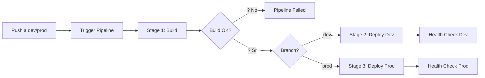
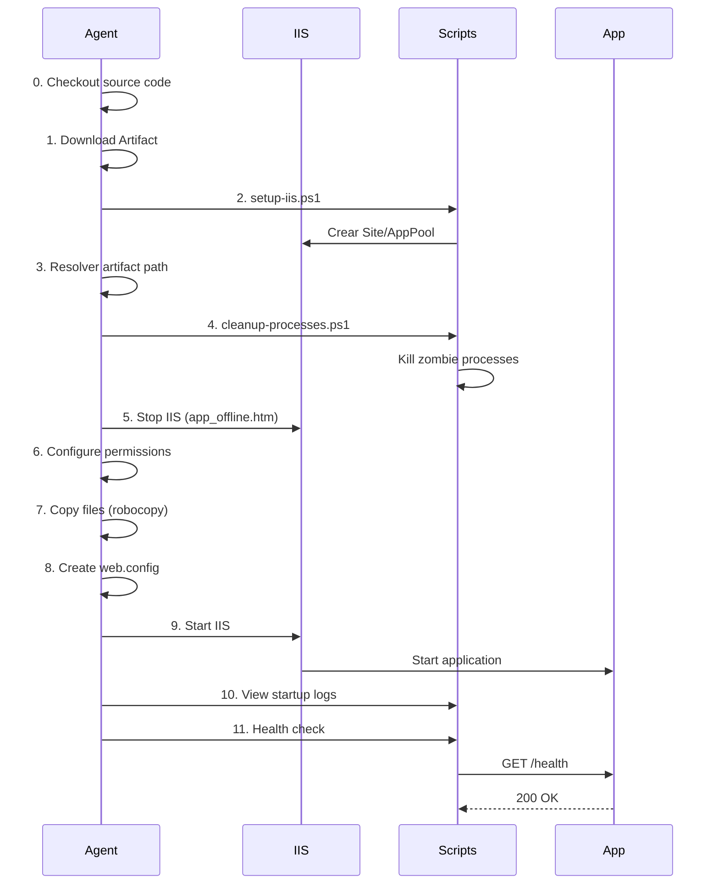

# ERP Backend API - Pipeline CI/CD Documentation

> **Proyecto**: ProvexBackendAPI  
> **Tecnología**: .NET 9 Web API  
> **CI/CD**: Azure DevOps Pipelines  
> **Deployment**: IIS (Windows Server)  

---

## ?? Tabla de Contenidos

- [Descripción General](#-descripción-general)
- [Estructura del Proyecto](#-estructura-del-proyecto)
- [Pipeline de CI/CD](#-pipeline-de-cicd)
- [Variables de Entorno](#-variables-de-entorno)
- [Scripts PowerShell](#-scripts-powershell)
- [Uso del Pipeline](#-uso-del-pipeline)
- [Troubleshooting](#-troubleshooting)

---

## ?? Descripción General

Pipeline automatizado que realiza:
- ? Build y publicación de la API .NET 9
- ? Deployment automático a Development/Production en IIS
- ? Health checks post-deployment
- ? Gestión automática de infraestructura IIS

### Características Principales

| Característica | Descripción |
|----------------|-------------|
| **Framework** | .NET 9 (framework-dependent deployment) |
| **Triggers** | Push automático a `dev` y `prod` |
| **Ambientes** | Development (IISDev), Production (IISAgent01) |
| **Deployment** | IIS con App Pool dedicado |
| **Artifacts** | Pipeline artifacts (20.6 MB aprox) |

---

## ?? Estructura del Proyecto

```
BackEnd-ERP/                                    # Raíz del repositorio
??? azure-pipelines.yml                         # ?? Punto de entrada principal
??? README.md                                   # ?? Este archivo
?
??? ProvexBackendAPI/                           # ?? Código fuente
?   ??? ProvexBackendAPI.csproj                # .NET 9 project
?   ??? Program.cs
?   ??? Controllers/
?   ??? Services/
?   ??? Features/
?   ?   ??? Estimaciones/
?   ??? Data/
?   ??? Migrations/
?   ??? Pipelines/                             # ?? Archivos de CI/CD
?       ??? azure-pipelines-backend.yml        # Pipeline principal
?       ??? scripts/                           # PowerShell scripts
?       ?   ??? setup-iis.ps1                 # Configuración IIS
?       ?   ??? cleanup-processes.ps1         # Limpieza de procesos
?       ?   ??? health-check.ps1              # Validación post-deploy
?       ??? templates/
?           ??? deploy-backend-template.yml    # Template reutilizable
```

### Descripción de Archivos Clave

| Archivo | Propósito |
|---------|-----------|
| `azure-pipelines.yml` | Orquestador principal (triggers y extends) |
| `azure-pipelines-backend.yml` | Pipeline completo (Build + Deploy stages) |
| `deploy-backend-template.yml` | Template parametrizado para deployment |
| `setup-iis.ps1` | Crea/configura infraestructura IIS |
| `cleanup-processes.ps1` | Mata procesos zombie de dotnet.exe |
| `health-check.ps1` | Valida que la API responda correctamente |

---

## ?? Pipeline de CI/CD

### Flujo General



### Stage 1: ?? Build & Publish

**Agente**: `PoolPrxSII` (Windows)

| # | Paso | Descripción |
|---|------|-------------|
| 1 | **Install .NET SDK** | Instala .NET 9.0.203 |
| 2 | **Clean obj/bin** | Elimina directorios de builds anteriores |
| 3 | **Restore packages** | `dotnet restore` |
| 4 | **Build** | `dotnet build --configuration Release` |
| 5 | **Publish** | `dotnet publish` (framework-dependent) |
| 6 | **Verify artifacts** | Valida existencia de `ProvexBackendAPI.dll` |
| 7 | **Publish artifact** | Sube artifact `ERPBackendAPI` al pipeline |

**Output**: Artifact de ~20.6 MB publicado

---

### Stage 2/3: ?? Deploy to IIS

**Prerequisitos**:
- ? Stage Build completado exitosamente
- ? Branch `dev` (para Dev) o `prod` (para Prod)
- ? Variable Groups configurados en Azure DevOps

#### Paso a Paso del Deployment



#### Detalles de Cada Paso

##### 0?? Checkout Source Code
```yaml
- checkout: self
  clean: true
```
**Por qué**: Los deployment jobs NO descargan código por defecto, solo artifacts. Este paso descarga los scripts PowerShell.

##### 1?? Download Artifact
- Descarga artifact `ERPBackendAPI` del Stage Build
- Path: `$(Pipeline.Workspace)\drop`

##### 2?? Setup IIS Infrastructure
```powershell
.\setup-iis.ps1 -SiteName "ERPApiSite" -AppPoolName "ERPApiPool" ...
```
- Crea directorio físico si no existe
- Crea App Pool (.NET Core / No Managed Code)
- Crea Site IIS con binding en puerto configurado

##### 3?? Resolve Artifact Path
- Busca `ProvexBackendAPI.dll` recursivamente en el artifact
- Establece variable `$(artifactPath)` con la ruta encontrada

##### 4?? Cleanup Zombie Processes
```powershell
.\cleanup-processes.ps1 -PhysicalPath "C:\inetpub\wwwroot\ERPApi"
```
- Mata procesos `dotnet.exe` que bloquean archivos
- Evita errores de "archivo en uso"

##### 5?? Stop IIS
- Crea `app_offline.htm` (pone el sitio en mantenimiento)
- Detiene el Site IIS
- Detiene el App Pool (espera hasta 30s)

##### 6?? Configure Permissions
- Quita atributo ReadOnly de archivos
- Otorga permisos al usuario actual
- Otorga permisos al AppPool (`IIS AppPool\ERPApiPool`)

##### 7?? Copy Files (Robocopy)
```powershell
robocopy $src $dst /MIR /MT:8 /R:2 /W:2 /FFT
```
- `/MIR`: Mirror (elimina archivos no presentes en origen)
- `/MT:8`: 8 threads paralelos
- Excluye: `logs/`, `app_offline.htm`

##### 8?? Create web.config
Genera `web.config` dinámicamente con:
- Variables de entorno (connection strings, JWT, Azure AD)
- Build info (número, commit hash, branch, fecha)
- Configuración ASP.NET Core Module

##### 9?? Start IIS
- Elimina `app_offline.htm`
- Inicia App Pool (espera hasta 30s a que esté Started)
- Inicia Site IIS

##### ?? View Startup Logs
- Busca último archivo `stdout_*.log`
- Muestra últimas 100 líneas
- **Condición**: `always()` (se ejecuta incluso si hay errores anteriores)

##### 1??1?? Health Check
```powershell
.\health-check.ps1 -Url "http://..." -MaxRetries 10 -WaitSeconds 3
```
- Realiza hasta 10 peticiones HTTP GET
- Espera 3s entre intentos
- Valida status code 200-399
- **No falla el pipeline** (solo warning)

---

## ?? Variables de Entorno

### Variable Groups en Azure DevOps

#### ?? `ERP-Backend-Development`

| Variable | Descripción | Valor Ejemplo |
|----------|-------------|---------------|
| **Infraestructura IIS** | | |
| `agentName` | Nombre del agente self-hosted | `IISDev` |
| `siteName` | Nombre del sitio IIS | `ERPApiSite` |
| `appPoolName` | Nombre del App Pool | `ERPApiPool` |
| `physicalPath` | Ruta física de deployment | `C:\inetpub\wwwroot\ERPApi` |
| `bindingPort` | Puerto HTTP del sitio | `8082` |
| `VerifyUrl` | URL para health check | `http://10.115.1.252:8082/api/v1/health` |
| **Aplicación** | | |
| `ASPNETCORE_ENVIRONMENT` | Entorno ASP.NET Core | `Development` |
| `ConnectionStrings__DatabaseConnection` | Connection string SQL Server | `Server=10.115.1.252;Database=ERPDB;...` |
| **JWT** | | |
| `Jwt__Issuer` | Emisor del token JWT | `Provex.Auth` |
| `Jwt__Audience` | Audiencia del token | `ProvexBackend.Client` |
| `Jwt__Key` | Clave secreta JWT (256-bit) | `Pr0v3xAuth0.2025@Sec...` |
| **Secrets** | | |
| `SecretKey` | Clave de encriptación general | `Esta es una clave secreta...` |
| **Azure AD** | | |
| `AzureAd__Instance` | URL de Azure AD | `https://login.microsoftonline.com/` |
| `AzureAd__Domain` | Dominio de la empresa | `https://provexsa.com` |
| `AzureAd__TenantId` | ID del tenant Azure AD | `b53c62c4-9e71-...` |
| `AzureAd__ClientId` | ID de aplicación Azure AD | `30597db0-8dfd-...` |

#### ?? `ERP-Backend-Production`

Las mismas variables que Development, con valores de producción:

| Variable | Valor Producción |
|----------|------------------|
| `agentName` | `IISAgent01` |
| `bindingPort` | `8083` |
| `VerifyUrl` | `https://api2.provexsa.cl/health` |
| `ASPNETCORE_ENVIRONMENT` | `Production` |
| `ConnectionStrings__DatabaseConnection` | `Server=10.115.1.251;...` |

### ¿Cómo se usan las variables?

1. **En el template**:
```yaml
variables:
  - group: ${{ parameters.variableGroup }}
```

2. **En web.config**:
```xml
<environmentVariable name="Jwt__Key" value="$(Jwt__Key)" />
```

3. **En la aplicación .NET**:
```csharp
Configuration["Jwt:Key"]
```

---

## ??? Scripts PowerShell

### ??? `setup-iis.ps1`

**Propósito**: Crear/configurar infraestructura IIS idempotentemente

**Parámetros**:
```powershell
-SiteName "ERPApiSite"
-AppPoolName "ERPApiPool"
-PhysicalPath "C:\inetpub\wwwroot\ERPApi"
-BindingPort 8082
```

**Funcionalidad**:
1. ? Crea directorio físico + subdirectorio `logs/`
2. ? Crea App Pool con configuración:
   - **Managed Runtime Version**: No Managed Code (.NET Core)
   - **Identity**: ApplicationPoolIdentity
   - **Idle Timeout**: 20 minutos
   - **Start Mode**: AlwaysRunning
3. ? Crea Site IIS:
   - Binding: `*:8082:` (todas las IPs, puerto 8082)
   - App Pool asociado
4. ? Es **idempotente**: Si ya existe, valida configuración

**Uso manual**:
```powershell
.\ProvexBackendAPI\Pipelines\scripts\setup-iis.ps1 `
  -SiteName "ERPApiSite" `
  -AppPoolName "ERPApiPool" `
  -PhysicalPath "C:\inetpub\wwwroot\ERPApi" `
  -BindingPort 8082
```

---

### ?? `cleanup-processes.ps1`

**Propósito**: Eliminar procesos zombie de `dotnet.exe` que bloquean archivos

**Parámetros**:
```powershell
-PhysicalPath "C:\inetpub\wwwroot\ERPApi"
```

**Funcionalidad**:
1. ?? Busca todos los procesos `dotnet.exe`
2. ?? Filtra los que tienen `CommandLine` conteniendo `PhysicalPath`
3. ? Mata esos procesos con `Stop-Process -Force`
4. ?? Espera 3 segundos antes de continuar

**Por qué es necesario**:
- En deployments fallidos, `dotnet.exe` puede quedar corriendo
- Bloquea archivos `.dll`, impidiendo el deployment
- Este script limpia antes de intentar copiar archivos

---

### ?? `health-check.ps1`

**Propósito**: Validar que la API responda correctamente post-deployment

**Parámetros**:
```powershell
-Url "http://10.115.1.252:8082/api/v1/health"
-MaxRetries 10
-WaitSeconds 3
```

**Funcionalidad**:
1. ? Espera 3s inicial (warm-up)
2. ?? Realiza hasta 10 intentos:
   - GET request al endpoint
   - Valida status code 200-399
   - Espera 3s entre intentos
3. ? Si responde: Exit 0 (success)
4. ?? Si falla 10 veces: Exit 0 con warning (NO falla el pipeline)

**Por qué NO falla el pipeline**:
- Permite investigar manualmente si hay problemas
- Los logs de IIS siguen disponibles en el paso anterior
- Evita rollbacks automáticos en casos de falsos positivos

---

## ?? Uso del Pipeline

### Desarrollo Local

```bash
# 1. Crear branch feature
git checkout -b feature/nueva-funcionalidad

# 2. Desarrollar
code ProvexBackendAPI/

# 3. Commit local
git add .
git commit -m "feat: Agregar endpoint de usuarios"

# 4. Push (NO activa pipeline)
git push origin feature/nueva-funcionalidad
```

### Deploy a Development

**Opción 1: Via Pull Request** (Recomendado)
```bash
# En Azure DevOps:
# 1. Crear Pull Request: feature/nueva-funcionalidad ? dev
# 2. Code review
# 3. Completar PR
# ? Pipeline se ejecuta automáticamente
```

**Opción 2: Push directo**
```bash
# Solo para hotfixes urgentes
git checkout dev
git merge feature/nueva-funcionalidad
git push origin dev
# ? Pipeline se ejecuta automáticamente
```

### Deploy a Production

```bash
# En Azure DevOps:
# 1. Crear Pull Request: dev ? prod
# 2. Aprobaciones requeridas (configurar en Branch Policies)
# 3. Completar PR
# ? Pipeline se ejecuta automáticamente en prod
```

### Monitorear la Ejecución

1. Ve a **Azure DevOps** ? **Pipelines**
2. Selecciona el pipeline en ejecución
3. Observa cada stage:

```
? Stage 1: Build & Publish
   ? Install .NET SDK 9.0.203
   ? Clean obj/bin
   ? Restore packages
   ? Build
   ? Publish
   ? Verificar artefactos
   ? Publish Artifact

? Stage 2: Deploy to Development
   ? Checkout source code        ? Scripts disponibles
   ? Download Artifact
   ? Setup IIS Infrastructure
   ? Resolve Artifact Path
   ? Cleanup Zombie Processes
   ? Stop IIS
   ? Configure Permissions
   ? Copy Files with Robocopy
   ? Create web.config
   ? Start IIS
   ? View Startup Logs
   ? Health Check
```

---

## ?? Troubleshooting

### ? Error: "ProvexBackendAPI.dll no encontrado"

**Síntoma**:
```
##[error]ProvexBackendAPI.dll no encontrado en artifact
```

**Causa**: El build no publicó correctamente

**Solución**:
1. Revisa logs del paso "Publish"
2. Verifica que el `.csproj` esté correcto
3. Intenta build local:
   ```bash
   dotnet publish -c Release -o ./publish
   ls ./publish/*.dll
   ```

---

### ? Error: "Invalid file path '...\\scripts\\setup-iis.ps1'"

**Síntoma**:
```
##[error]Invalid file path 'C:\agent\_work\2\s\ProvexBackendAPI\Pipelines\scripts\setup-iis.ps1'
```

**Causa**: El código fuente no se descargó (falta `checkout: self`)

**Solución**:
1. Verifica que `deploy-backend-template.yml` tenga:
   ```yaml
   steps:
   - checkout: self
     clean: true
   ```
2. Haz push del cambio
3. Re-ejecuta el pipeline

---

### ? Error: App Pool no inicia

**Síntoma**:
```
AppPool no arrancó en 30 segundos
```

**Causa**: Posibles errores en la aplicación o configuración

**Solución**:
1. Revisa logs en el servidor IIS:
   ```
   C:\inetpub\wwwroot\ERPApi\logs\stdout_*.log
   ```
2. Verifica Event Viewer:
   ```
   Windows Logs ? Application
   Filtrar por: "IIS AspNetCore Module"
   ```
3. Valida web.config:
   ```powershell
   Get-Content C:\inetpub\wwwroot\ERPApi\web.config
   ```

---

### ?? Warning: Health Check falló (pero pipeline exitoso)

**Síntoma**:
```
Health check failed after 10 retries
Pipeline status: Success ?
```

**Causa**: API no responde en `/health` (pero deployment completó)

**Solución**:
1. Conéctate al servidor IIS
2. Revisa logs de la aplicación
3. Valida manualmente:
   ```powershell
   Invoke-WebRequest -Uri "http://localhost:8082/api/v1/health"
   ```
4. Si la API funciona, ajusta timeout en `health-check.ps1`

---

### ?? Error: Permiso denegado al copiar archivos

**Síntoma**:
```
robocopy: Access denied
```

**Causa**: El App Pool no tiene permisos en el directorio

**Solución manual**:
```powershell
# En el servidor IIS
icacls "C:\inetpub\wwwroot\ERPApi" /grant "IIS AppPool\ERPApiPool:(OI)(CI)M" /T
```

---

## ?? Referencias

- [ASP.NET Core deployment to IIS](https://learn.microsoft.com/aspnet/core/host-and-deploy/iis/)
- [Azure Pipelines YAML schema](https://learn.microsoft.com/azure/devops/pipelines/yaml-schema)
- [Deployment jobs](https://learn.microsoft.com/azure/devops/pipelines/process/deployment-jobs)
- [.NET 9 Release Notes](https://learn.microsoft.com/dotnet/core/whats-new/dotnet-9)

---

## ?? Soporte

**Equipo DevOps**: german.kettlun@provexsa.cl  
**Repositorio**: https://dev.azure.com/Provex/ERP-BackEnd  
**Documentación**: Este README.md

---

**Última actualización**: 2024-11-20  
**Versión del pipeline**: 1.0  
**Estado**: ? Producción
